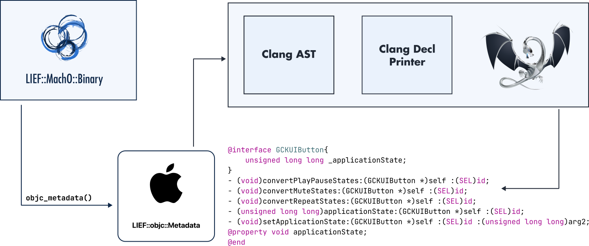

.. _extended-objc:

:fa:`brands fa-apple` Objective-C
---------------------------------

.. toctree::
  :caption: <i class="fa-solid fa-code">&nbsp;</i>API
  :maxdepth: 2

  cpp
  python
  rust

----

Introduction
************

This module enables inspecting Objective-C metadata within a Mach-O
binary.

If a Mach-O binary embeds Objective-C metadata, it can be accessed through
|lief-macho-binary-objc-metadata|:

.. tabs::

  .. tab:: :fa:`brands fa-python` Python

      .. literalinclude:: ../../../code/python/objc.py
        :language: python
        :start-after: lief-doc: check-start
        :end-before: lief-doc: check-end
        :dedent:

  .. tab:: :fa:`regular fa-file-code` C++

      .. literalinclude:: ../../../code/cpp/objc.cpp
        :language: cpp
        :start-after: lief-doc: check-start
        :end-before: lief-doc: check-end
        :dedent:

  .. tab:: :fa:`brands fa-rust` Rust

      .. literalinclude:: ../../../code/rust/src/objc.rs
        :language: rust
        :start-after: lief-doc: check-start
        :end-before: lief-doc: check-end
        :dedent:

At this point, one can use the API exposed by the |lief-objc-metadata| class
to inspect the Objective-C metadata.

In particular, the |lief-objc-metadata-to_decl| function can be used to generate
a header-like output of all the Objective-C metadata found in the binary.

.. tabs::

  .. tab:: :fa:`brands fa-python` Python

      .. literalinclude:: ../../../code/python/objc.py
        :language: python
        :start-after: lief-doc: inspect-start
        :end-before: lief-doc: inspect-end
        :dedent:

  .. tab:: :fa:`regular fa-file-code` C++

      .. literalinclude:: ../../../code/cpp/objc.cpp
        :language: cpp
        :start-after: lief-doc: inspect-start
        :end-before: lief-doc: inspect-end
        :dedent:

  .. tab:: :fa:`brands fa-rust` Rust

    .. literalinclude:: ../../../code/rust/src/objc.rs
      :language: rust
      :start-after: lief-doc: inspect-start
      :end-before: lief-doc: inspect-end
      :dedent:

Class Dump
**********

When performing binary analysis, it can be useful to generate header-like
information to get a global overview of the structures present in the
Objective-C metadata.

LIEF provides a way to generate this header-like information at various levels:

- |lief-objc-metadata-to_decl_opt|
- |lief-objc-class-to_decl_opt|
- |lief-objc-proto-to_decl_opt|

Technically, this output is created by generating a Clang AST and applying
the LLVM printer visitor to it.

.. tabs::

  .. tab:: :fa:`brands fa-rust` Code

    .. literalinclude:: ../../../code/rust/src/objc.rs
      :language: rust
      :start-after: lief-doc: classdump-start
      :end-before: lief-doc: classdump-end
      :dedent:

  .. tab:: :fa:`solid fa-terminal` Result

    .. code-block:: objc

      @interface APMEventFilter<APMAudienceFilter> {
          bool _sessionScoped;
          bool _dynamic;
          bool _sequence;
          int _audienceID;
          int _filterID;
          NSString * _eventName;
          NSData * _data;
      }
      // Address: 0x0101859ee0
      - (NSObject *)initWithAudienceID:(APMEventFilter *)self filterID:(SEL)id eventName:(int)arg2 data:(int)arg3 sessionScoped:(NSObject *)arg4 dynamic:(NSObject *)arg5 sequence:(bool)arg6 :(bool)arg7 :(bool)arg8;
      // Address: 0x0101682590
      - (int)audienceID:(APMEventFilter *)self :(SEL)id;
      // Address: 0x01017b6d98
      - (int)filterID:(APMEventFilter *)self :(SEL)id;
      // Address: 0x01018a4a6c
      - (bool)isSessionScoped:(APMEventFilter *)self :(SEL)id;
      // Address: 0x01017630d4
      - (bool)isDynamic:(APMEventFilter *)self :(SEL)id;
      // Address: 0x01016adbb4
      - (bool)isSequence:(APMEventFilter *)self :(SEL)id;
      // Address: 0x010187a5f8
      - (NSObject *)eventName:(APMEventFilter *)self :(SEL)id;
      // Address: 0x0101581bfc
      - (NSObject *)data:(APMEventFilter *)self :(SEL)id;
      // Address: 0x01018e1f3c
      - (void).cxx_destruct:(APMEventFilter *)self :(SEL)id;
      @property void eventName;
      @property void data;
      @property void audienceID;
      @property void filterID;
      @property void sessionScoped;
      @property void dynamic;
      @property void sequence;
      @property void hash;
      @property void superclass;
      @property void description;
      @property void debugDescription;
      @end

The |lief-objc-declopt| can be used to customize the generated output. For
example, we can remove the commented addresses associated with Objective-C
methods using this option:

.. literalinclude:: ../../../code/python/objc.py
  :language: python
  :start-after: lief-doc: no-address-start
  :end-before: lief-doc: no-address-end
  :dedent:

:fa:`solid fa-book-open-reader` References
*******************************************

- :github-ref:`romainthomas/iCDump`
- :github-ref:`nygard/class-dump`
- https://www.romainthomas.fr/post/23-01-icdump/

API
****

You can find the documentation of the API for the different languages here:

:fa:`brands fa-python` :doc:`Python API <python>`

:fa:`regular fa-file-code` :doc:`C++ API <cpp>`

:fa:`brands fa-rust` Rust API: :rust:module:`lief::objc`

.. include:: ../../_cross_api.rst
