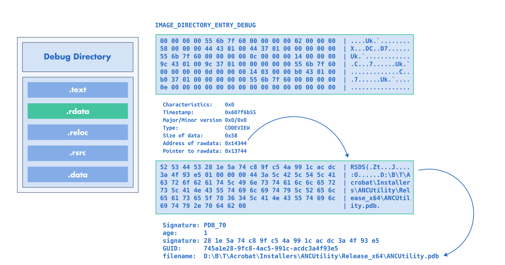

.. _pe_debug_modification:

:fa:`solid fa-gears` Debug Modification
---------------------------------------

LIEF can create, modify, or delete PE debug information entries.

This debug information is located in the ``IMAGE_DIRECTORY_ENTRY_DEBUG`` and is
represented in LIEF through the |lief-pe-debug| class.

These entries can be modified using the API exposed by these structures.
For example, the PDB path referenced in a |lief-pe-codeviewpdb| entry can be
changed as follows:

.. tabs::

  .. tab:: :fa:`brands fa-python` Python

      .. literalinclude:: ../../../../code/python/pe_debug.py
        :language: python
        :start-after: lief-doc: change-name-start
        :end-before: lief-doc: change-name-end
        :dedent:

  .. tab:: :fa:`regular fa-file-code` C++

     .. literalinclude:: ../../../../code/cpp/pe_debug.cpp
        :language: cpp
        :start-after: lief-doc: change-name-start
        :end-before: lief-doc: change-name-end
        :dedent:

  .. tab:: :fa:`brands fa-rust` Rust

      .. literalinclude:: ../../../../code/rust/src/pe_debug.rs
        :language: rust
        :start-after: lief-doc: change-name-start
        :end-before: lief-doc: change-name-end
        :dedent:

The |lief-pe-binary-remove-debug| function can be used to remove a specific
entry, whereas the |lief-pe-binary-clear-debug| function removes **all**
debug entries:

.. tabs::

  .. tab:: :fa:`brands fa-python` Python

      .. literalinclude:: ../../../../code/python/pe_debug.py
        :language: python
        :start-after: lief-doc: remove-start
        :end-before: lief-doc: remove-end
        :dedent:

  .. tab:: :fa:`regular fa-file-code` C++

      .. literalinclude:: ../../../../code/cpp/pe_debug.cpp
        :language: cpp
        :start-after: lief-doc: remove-start
        :end-before: lief-doc: remove-end
        :dedent:

  .. tab:: :fa:`brands fa-rust` Rust

      .. literalinclude:: ../../../../code/rust/src/pe_debug.rs
        :language: rust
        :start-after: lief-doc: remove-start
        :end-before: lief-doc: remove-end
        :dedent:

Finally, |lief-pe-binary-add-debug-info| can be used to add a crafted debug
entry to an existing PE.

For example, a custom |lief-pe-codeviewpdb| can be created as follows:

.. tabs::

  .. tab:: :fa:`brands fa-python` Python

      .. literalinclude:: ../../../../code/python/pe_debug.py
        :language: python
        :start-after: lief-doc: add-start
        :end-before: lief-doc: add-end
        :dedent:

  .. tab:: :fa:`regular fa-file-code` C++

      .. literalinclude:: ../../../../code/cpp/pe_debug.cpp
        :language: cpp
        :start-after: lief-doc: add-start
        :end-before: lief-doc: add-end
        :dedent:

  .. tab:: :fa:`brands fa-rust` Rust

      .. literalinclude:: ../../../../code/rust/src/pe_debug.rs
        :language: rust
        :start-after: lief-doc: add-start
        :end-before: lief-doc: add-end
        :dedent:

.. include:: ../../../_cross_api.rst
