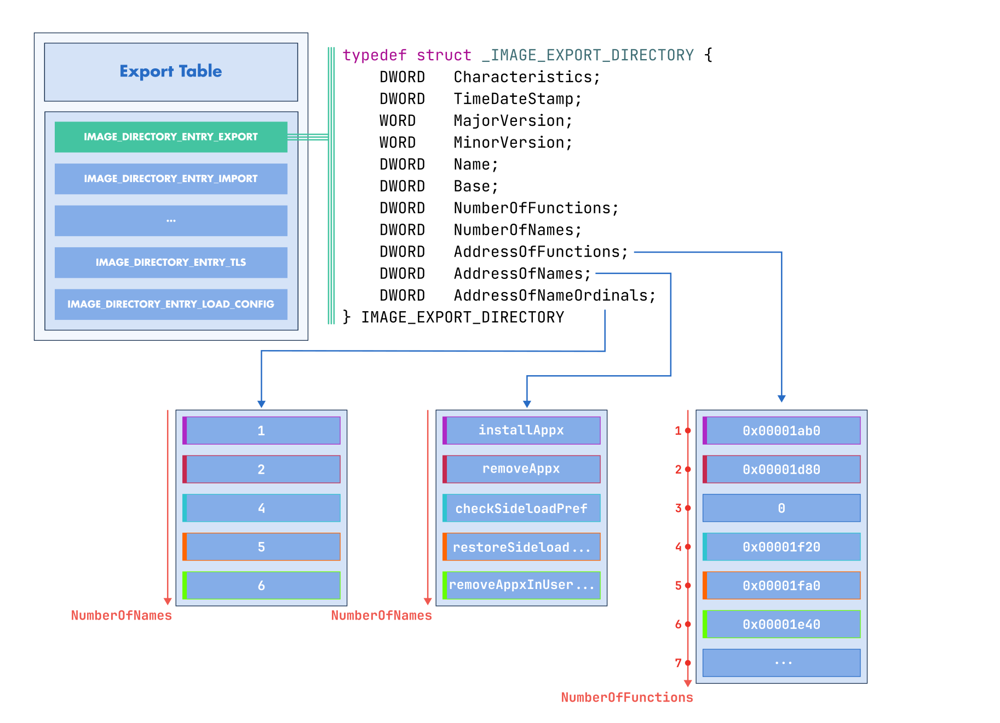

:fa:`solid fa-gears` Exports Modification
-----------------------------------------

LIEF provides extensive support for modifying the PE export table, enabling you
to add, remove, or modify export entries, or create an entire export table for
a PE binary.

This functionality requires enabling |lief-pe-builder-config-exports|, as the
modified export table is **relocated** to a **new** section. The section name
can be controlled with |lief-pe-builder-config-export_section|.

Creating Export Entries
~~~~~~~~~~~~~~~~~~~~~~~

Creating a |lief-pe-export-entry| is useful for exposing a "hidden" function by
its address, allowing it to be used like a standard linker-generated export.

This could be used for code lifting or fuzzing.

.. tabs::

  .. tab:: :fa:`brands fa-python` Python

      .. literalinclude:: ../../../../code/python/pe_exports.py
        :language: python
        :start-after: lief-doc: create-entries-start
        :end-before: lief-doc: create-entries-end
        :dedent:

  .. tab:: :fa:`regular fa-file-code` C++

      .. literalinclude:: ../../../../code/cpp/pe_exports.cpp
        :language: cpp
        :start-after: lief-doc: create-entries-start
        :end-before: lief-doc: create-entries-end
        :dedent:

  .. tab:: :fa:`brands fa-rust` Rust

      .. literalinclude:: ../../../../code/rust/src/pe_exports.rs
        :language: rust
        :start-after: lief-doc: create-entries-start
        :end-before: lief-doc: create-entries-end
        :dedent:

Creating an Export Table
~~~~~~~~~~~~~~~~~~~~~~~~

This section introduces the API for creating an export table. We'll explore a
scenario where we want to convert a PE executable into a DLL.

.. note::

  The process of converting an executable to a library is also detailed for ELF
  binaries in the tutorial: :ref:`tuto_elf_bin2lib`.

First, we must update the PE headers to ensure they are compliant with the DLL
format:

.. tabs::

  .. tab:: :fa:`brands fa-python` Python

      .. literalinclude:: ../../../../code/python/pe_exports.py
        :language: python
        :start-after: lief-doc: dll-header-start
        :end-before: lief-doc: dll-header-end
        :dedent:

  .. tab:: :fa:`regular fa-file-code` C++

      .. literalinclude:: ../../../../code/cpp/pe_exports.cpp
        :language: cpp
        :start-after: lief-doc: dll-header-start
        :end-before: lief-doc: dll-header-end
        :dedent:

  .. tab:: :fa:`brands fa-rust` Rust

      .. literalinclude:: ../../../../code/rust/src/pe_exports.rs
        :language: rust
        :start-after: lief-doc: dll-header-start
        :end-before: lief-doc: dll-header-end
        :dedent:

Then, we can start creating and populating a new export table:

.. tabs::

  .. tab:: :fa:`brands fa-python` Python

      .. literalinclude:: ../../../../code/python/pe_exports.py
        :language: python
        :start-after: lief-doc: create-table-start
        :end-before: lief-doc: create-table-end
        :dedent:

  .. tab:: :fa:`regular fa-file-code` C++

      .. literalinclude:: ../../../../code/cpp/pe_exports.cpp
        :language: cpp
        :start-after: lief-doc: create-table-start
        :end-before: lief-doc: create-table-end
        :dedent:

  .. tab:: :fa:`brands fa-rust` Rust

      .. literalinclude:: ../../../../code/rust/src/pe_exports.rs
        :language: rust
        :start-after: lief-doc: create-table-start
        :end-before: lief-doc: create-table-end
        :dedent:

.. admonition:: Limitations
  :class: tip

  This binary-to-library example assumes that the original executable was
  compiled to be position-independent, meaning it contains relocations.

Within a Python environment, we can verify that ``lib_exe2dll.dll`` can be
loaded as a DLL and that we can call ``cbk1`` and ``cbk2``:

.. code-block:: python

  import ctypes

  lib = ctypes.windll.LoadLibrary("lib_exe2dll.dll")

  assert lib.cbk1() >= 0
  assert lib.cbk2() >= 0

.. include:: ../../../_cross_api.rst
