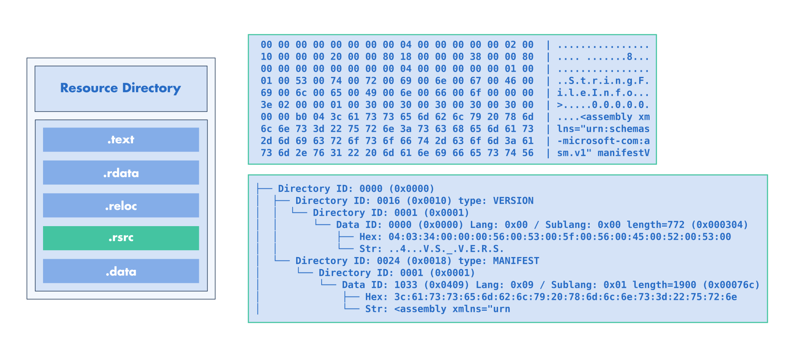

:fa:`solid fa-gears` Resources Modification
-------------------------------------------

LIEF allows you to modify (or create) PE resources at different levels:

- Directly on the binary tree (|lief-pe-resource-node|)
- Using the |lief-pe-resource-manager|.

Binary Tree Modifications
*************************

The resource root node can be accessed using the |lief-pe-binary-resources|
function:

.. tabs::

  .. tab:: :fa:`brands fa-python` Python

      .. literalinclude:: ../../../../code/python/pe_resources.py
        :language: python
        :start-after: lief-doc: access-root-start
        :end-before: lief-doc: access-root-end
        :dedent:

  .. tab:: :fa:`regular fa-file-code` C++

      .. literalinclude:: ../../../../code/cpp/pe_resources.cpp
        :language: cpp
        :start-after: lief-doc: access-root-start
        :end-before: lief-doc: access-root-end
        :dedent:

  .. tab:: :fa:`brands fa-rust` Rust

      .. literalinclude:: ../../../../code/rust/src/pe_resources.rs
        :language: rust
        :start-after: lief-doc: access-root-start
        :end-before: lief-doc: access-root-end
        :dedent:

From this |lief-pe-resource-node| instance, you can use the
|lief-pe-resource-node-add-child| or |lief-pe-resource-node-remove-child|
functions to add or delete nodes:

.. tabs::

  .. tab:: :fa:`brands fa-python` Python

      .. literalinclude:: ../../../../code/python/pe_resources.py
        :language: python
        :start-after: lief-doc: add-child-start
        :end-before: lief-doc: add-child-end
        :dedent:

  .. tab:: :fa:`regular fa-file-code` C++

      .. literalinclude:: ../../../../code/cpp/pe_resources.cpp
        :language: cpp
        :start-after: lief-doc: add-child-start
        :end-before: lief-doc: add-child-end
        :dedent:

  .. tab:: :fa:`brands fa-rust` Rust

      .. literalinclude:: ../../../../code/rust/src/pe_resources.rs
        :language: rust
        :start-after: lief-doc: add-child-start
        :end-before: lief-doc: add-child-end
        :dedent:

This low-level API can be used to modify the tree or change the data of a
specific node.

.. admonition:: Pretty Printing
  :class: tip

  You can also *print* a node to get a formatted representation of the
  resource tree:

  .. literalinclude:: ../../../../code/python/pe_resources.py
    :language: python
    :start-after: lief-doc: pretty-print-start
    :end-before: lief-doc: pretty-print-end
    :dedent:

  .. code-block:: text

    ├── Directory ID: 0000 (0x0000)
    │  ├── Directory ID: 0016 (0x0010) type: VERSION
    │  │  └── Directory ID: 0001 (0x0001)
    │  │      └── Data ID: 0000 (0x0000) Lang: 0x00 / Sublang: 0x00 length=772 (0x000304), offset: 0x1ca0
    │  │          ├── Hex: 04:03:34:00:00:00:56:00:53:00:5f:00:56:00:45:00:52:00:53:00
    │  │          └── Str: ..4...V.S._.V.E.R.S.
    │  └── Directory ID: 0024 (0x0018) type: MANIFEST
    │      └── Directory ID: 0001 (0x0001)
    │          └── Data ID: 1033 (0x0409) Lang: 0x09 / Sublang: 0x01 length=1900 (0x00076c), offset: 0x1fa4
    │              ├── Hex: 3c:61:73:73:65:6d:62:6c:79:20:78:6d:6c:6e:73:3d:22:75:72:6e
    │              └── Str: <assembly xmlns="urn

Resources Manager
*****************

The |lief-pe-resource-manager| provides a higher-level API for the resource
tree. It can also be used to set or change resource elements such as the
manifest:

.. tabs::

  .. tab:: :fa:`brands fa-python` Python

      .. literalinclude:: ../../../../code/python/pe_resources.py
        :language: python
        :start-after: lief-doc: manifest-start
        :end-before: lief-doc: manifest-end
        :dedent:

  .. tab:: :fa:`regular fa-file-code` C++

      .. literalinclude:: ../../../../code/cpp/pe_resources.cpp
        :language: cpp
        :start-after: lief-doc: manifest-start
        :end-before: lief-doc: manifest-end
        :dedent:

  .. tab:: :fa:`brands fa-rust` Rust

      .. literalinclude:: ../../../../code/rust/src/pe_resources.rs
        :language: rust
        :start-after: lief-doc: manifest-start
        :end-before: lief-doc: manifest-end
        :dedent:

Resource Tree Transfer between Binaries
***************************************

LIEF can transfer the resource tree from one binary to another.
This operation can be performed using the |lief-pe-binary-set_resources|
function:

.. tabs::

  .. tab:: :fa:`brands fa-python` Python

      .. literalinclude:: ../../../../code/python/pe_resources.py
        :language: python
        :start-after: lief-doc: transfer-start
        :end-before: lief-doc: transfer-end
        :dedent:

  .. tab:: :fa:`regular fa-file-code` C++

      .. literalinclude:: ../../../../code/cpp/pe_resources.cpp
        :language: cpp
        :start-after: lief-doc: transfer-start
        :end-before: lief-doc: transfer-end
        :dedent:

  .. tab:: :fa:`brands fa-rust` Rust

      .. literalinclude:: ../../../../code/rust/src/pe_resources.rs
        :language: rust
        :start-after: lief-doc: transfer-start
        :end-before: lief-doc: transfer-end
        :dedent:

.. include:: ../../../_cross_api.rst
