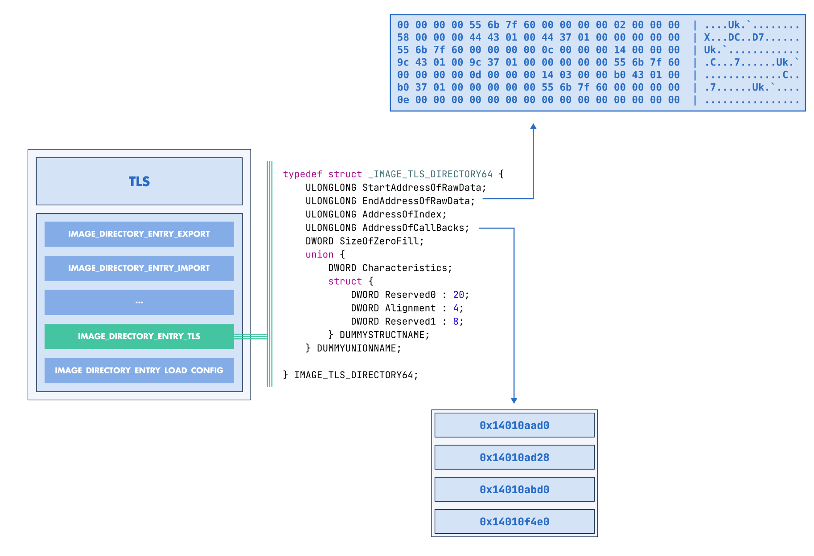

:fa:`solid fa-gears` TLS Modification
--------------------------------------

LIEF can be used to **modify**, **create**, or **remove** Thread Local Storage (TLS)
information.

TLS Modifications
~~~~~~~~~~~~~~~~~

All attributes of the |lief-pe-tls| interface can be modified as long as the
changes are consistent with the layout of the PE binary. For instance, you
can adjust the TLS callbacks by removing, reordering, or adding addresses:

.. tabs::

  .. tab:: :fa:`brands fa-python` Python

      .. literalinclude:: ../../../../code/python/pe_tls.py
        :language: python
        :start-after: lief-doc: modify-callbacks-start
        :end-before: lief-doc: modify-callbacks-end
        :dedent:

  .. tab:: :fa:`regular fa-file-code` C++

      .. literalinclude:: ../../../../code/cpp/pe_tls.cpp
        :language: cpp
        :start-after: lief-doc: modify-callbacks-start
        :end-before: lief-doc: modify-callbacks-end
        :dedent:

  .. tab:: :fa:`brands fa-rust` Rust

      .. literalinclude:: ../../../../code/rust/src/pe_tls.rs
        :language: rust
        :start-after: lief-doc: modify-callbacks-start
        :end-before: lief-doc: modify-callbacks-end
        :dedent:

.. admonition:: Relocations
  :class: tip

  Note that LIEF **automatically** manages the relocations that must be
  created or removed when modifying the TLS callbacks.

TLS Creation
~~~~~~~~~~~~

If a PE binary does not contain TLS metadata, LIEF can be used to create this
structure.

First, we can create and initialize a TLS instance:

.. tabs::

  .. tab:: :fa:`brands fa-python` Python

      .. literalinclude:: ../../../../code/python/pe_tls.py
        :language: python
        :start-after: lief-doc: create-tls-start
        :end-before: lief-doc: create-tls-end
        :dedent:

  .. tab:: :fa:`regular fa-file-code` C++

      .. literalinclude:: ../../../../code/cpp/pe_tls.cpp
        :language: cpp
        :start-after: lief-doc: create-tls-start
        :end-before: lief-doc: create-tls-end
        :dedent:

  .. tab:: :fa:`brands fa-rust` Rust

      .. literalinclude:: ../../../../code/rust/src/pe_tls.rs
        :language: rust
        :start-after: lief-doc: create-tls-start
        :end-before: lief-doc: create-tls-end
        :dedent:

And then, we can add this instance to a |lief-pe-binary|:

.. tabs::

  .. tab:: :fa:`brands fa-python` Python

      .. literalinclude:: ../../../../code/python/pe_tls.py
        :language: python
        :start-after: lief-doc: add-tls-start
        :end-before: lief-doc: add-tls-end
        :dedent:

  .. tab:: :fa:`regular fa-file-code` C++

      .. literalinclude:: ../../../../code/cpp/pe_tls.cpp
        :language: cpp
        :start-after: lief-doc: add-tls-start
        :end-before: lief-doc: add-tls-end
        :dedent:

  .. tab:: :fa:`brands fa-rust` Rust

      .. literalinclude:: ../../../../code/rust/src/pe_tls.rs
        :language: rust
        :start-after: lief-doc: add-tls-start
        :end-before: lief-doc: add-tls-end
        :dedent:

.. admonition:: Relocations
  :class: tip

  Similar to TLS callback modifications, LIEF **automatically** manages
  relocations. In addition, it automatically initializes (if not set by the
  user) ``AddressOfIndex``, which is required when setting up TLS metadata.

.. include:: ../../../_cross_api.rst
