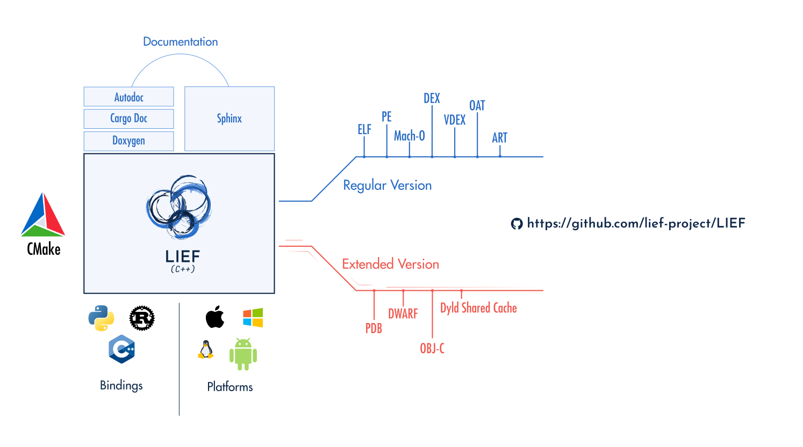

:fa:`solid fa-door-open` Introduction
=====================================

The purpose of this project is to provide a cross-platform library to parse,
modify, and abstract the :ref:`ELF <format-elf>`, :ref:`PE <format-pe>`, and
:ref:`Mach-O <format-macho>` formats.

From a technical standpoint, the library is written in C++ with a C++11 public
interface and exposes bindings for Python and Rust.

As a result, you can use LIEF through an idiomatic API in these languages:

.. tabs::

  .. tab:: :fa:`brands fa-python` Python

    .. literalinclude:: ../code/python/intro.py
      :language: python
      :prepend: import lief
      :start-after: lief-doc: intro-start
      :end-before: lief-doc: intro-end
      :dedent:

  .. tab:: :fa:`regular fa-file-code` C++

      .. literalinclude:: ../code/cpp/intro.cpp
        :language: cpp
        :prepend: #include <LIEF/LIEF.hpp>
        :start-after: lief-doc: intro-start
        :end-before: lief-doc: intro-end
        :dedent:

  .. tab:: :fa:`brands fa-rust` Rust

    .. literalinclude:: ../code/rust/src/intro.rs
      :language: rust
      :start-after: lief-doc: intro-start
      :end-before: lief-doc: intro-end
      :dedent:

The project is also dedicated to providing comprehensive documentation and
maintaining strong development standards, including:

- A test suite with code coverage and non-regression testing
- Address Sanitizer checks (`ASAN <https://clang.llvm.org/docs/AddressSanitizer.html>`_)
- Continuous Integration for testing and releasing packages
- Dockerization of various CI steps
- A comprehensive :ref:`changelog <changelog-ref>`
- Nightly builds

|

To get started with LIEF's features, you can check the documentation for specific
formats: :ref:`ELF <format-elf>`, :ref:`PE <format-pe>`, or :ref:`Mach-O <format-macho>`.
Integrating LIEF into your project is also straightforward:

.. tabs::

  .. tab:: :fa:`brands fa-python` Python

      **With pip**

      .. code-block:: console

        $ pip install lief

      **Using a requirements.txt file**

      .. code-block:: text

        lief==1.0.0

  .. tab:: :fa:`regular fa-file-code` C++

      **Compiler command line**

      .. code-block:: console

        $ clang++ -lLIEF -I<LIEF_INSTALL>/include/ ...

      **CMake**

      .. code-block:: cmake

        find_package(LIEF)

        target_link_libraries(my-project LIEF::LIEF)

  .. tab:: :fa:`brands fa-rust` Rust

      **Nightly version**

      .. code-block:: toml

        # For nightly build
        [dependencies]
        lief = { git = "https://github.com/lief-project/LIEF", branch = "main" }

      **Released version**

      .. code-block:: toml

        # For a tagged release
        [dependencies]
        lief = "1.0.0"

You can find additional content, including release notes, on the `LIEF blog </blog/>`_:

- `LIEF 1.0.0  release info </blog/2026-07-13-lief-1-0-0/>`_
- `LIEF 0.17.0 release info </blog/2025-09-14-lief-0-17-0/>`_
- `LIEF 0.16.0 release info </blog/2024-12-10-lief-0-16-0/>`_
- `LIEF 0.15.0 release info </blog/2024-07-21-lief-0.15-0/>`_
- `LIEF 0.14.0 release info </blog/2024-01-20-lief-0-14-0/>`_
- `LIEF 0.13.0 release info </blog/2023-04-09-lief-0-13-0/>`_
- `LIEF 0.12.0 release info </blog/2022-03-27-lief-v0-12-0/>`_
- `LIEF 0.11.1 release info </blog/2021-02-22-lief-0-11-1/>`_
- `LIEF 0.11.0 release info </blog/2021-01-19-lief-0-11-0/>`_
- `LIEF 0.9.0 release info </blog/2018-06-11-lief-0-9-0/>`_

Additional practical examples are available in the
`examples/ <https://github.com/lief-project/LIEF/tree/main/examples>`_ directory.

:fa:`cubes` Extended Version
~~~~~~~~~~~~~~~~~~~~~~~~~~~~

For those seeking enhanced support for :ref:`PDB <extended-pdb>`,
:ref:`DWARF <extended-dwarf>`, or :ref:`Objective-C <extended-objc>` (and more),
check out the :ref:`extended section <extended-intro>`.

:fa:`solid fa-book` Additional Documentation
~~~~~~~~~~~~~~~~~~~~~~~~~~~~~~~~~~~~~~~~~~~~

* :fa:`solid fa-book` `Doxygen <../../doxygen/>`_
* :fa:`brands fa-rust` Rust documentation:

  - Stable: |lief-rust-doc|
  - Nightly: |lief-rust-doc-nightly|
