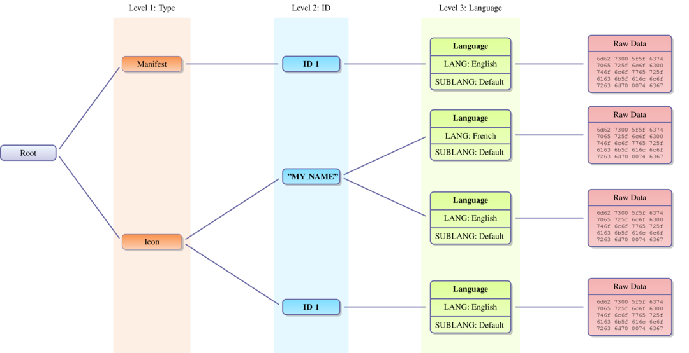
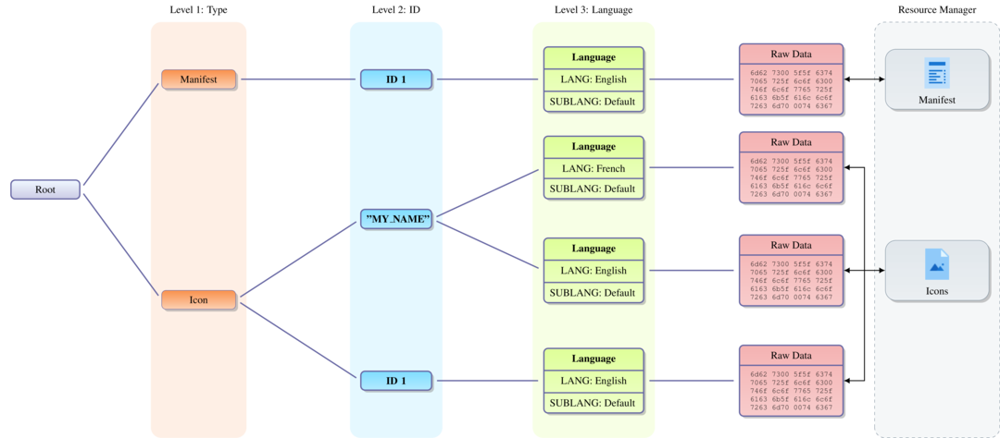

07 - PE Resources
-----------------

This tutorial provides an overview of the resource structure in a PE file and
explains how to manipulate it using LIEF.

------

Unlike the **ELF** and **Mach-O** formats, **PE** enables embedding *resources*
(icons, images, dialogs, etc.) within an executable or a DLL.

These resources are usually located in the ``.rsrc`` section, but this is not
an absolute rule.

To retrieve the section where resources are located, you can use the
:attr:`~lief.PE.DataDirectory.section` attribute of the associated
:class:`~lief.PE.DataDirectory`:

.. literalinclude:: ../../code/python/tuto_pe_resource.py
  :language: python
  :start-after: lief-doc: resource-section-start
  :end-before: lief-doc: resource-section-end
  :dedent:

.. code-block:: console

  .rsrc     22e0d8    23f000    22e200    236c00    0         4.3596    CNT_INITIALIZED_DATA - MEM_READ

Resource Structure
******************

The underlying structure used to represent resources is a tree:

In the resource tree, there are basically two kinds of nodes:

#. :class:`~lief.PE.ResourceDirectory`: Contains information about the subtree.
#. :class:`~lief.PE.ResourceData`: Used to store raw data. These nodes are the **leaves** of the tree.

The first three levels of the tree have a special meaning:

* Level 1: The :attr:`~lief.PE.ResourceDirectory.id` represents the :class:`~lief.PE.ResourcesManager.TYPE`.
* Level 2: The :attr:`~lief.PE.ResourceDirectory.id` represents an ID for accessing the resource.
* Level 3: The :attr:`~lief.PE.ResourceDirectory.id` represents the :class:`~lief.PE.RESOURCE_LANGS` / SUBLANG of the resource.

You can check if a given binary embeds resources using the
:attr:`~lief.PE.Binary.has_resources` property. You can then access this
structure through the :attr:`~lief.PE.Binary.resources` property, which returns
a :class:`~lief.PE.ResourceDirectory` representing the **root** of the tree.

Given a :class:`~lief.PE.ResourceDirectory`, the
:attr:`~lief.PE.ResourceDirectory.childs` property returns an **iterator**
(similar to a ``list``) over the subtree associated with the node.

The following snippet retrieves the :attr:`~lief.PE.ResourcesManager.TYPE.MANIFEST`
element and prints it:

.. literalinclude:: ../../code/python/tuto_pe_resource.py
  :language: python
  :start-after: lief-doc: manifest-tree-start
  :end-before: lief-doc: manifest-tree-end
  :dedent:

.. code-block:: console

  [DIRECTORY] - ID: 0x18 - Depth: 1 - Childs : 1
      Characteristics :         0
      Time/Date stamp :         0
      Major version :           0
      Minor version :           0
      Number of name entries :  0
      Number of id entries :    1

  [DIRECTORY] - ID: 0x01 - Depth: 2 - Childs : 1
      Characteristics :         0
      Time/Date stamp :         0
      Major version :           0
      Minor version :           0
      Number of name entries :  0
      Number of id entries :    1

  [DATA] - ID: 0x409 - Depth: 3 - Childs : 0
      Code page :  0
      Reserved :   0
      Size :       1666
      Hash :       ffffffffb00b5419

  <?xml version="1.0" encoding="UTF-8" standalone="yes"?>
  <assembly xmlns="urn:schemas-microsoft-com:asm.v1" manifestVersion="1.0" xmlns:asmv3="urn:schemas-microsoft-com:asm.v3">
    <assemblyIdentity
      name="FileZilla"
  ...

Since manipulating a tree directly can be inconvenient, LIEF exposes a
:class:`~lief.PE.ResourcesManager`, which provides an enhanced API for
manipulating binary resources.

Resource Manager
****************

As mentioned previously, the :class:`~lief.PE.ResourcesManager` acts as a
wrapper around the resource tree to:

* Parse resources with predefined structures, such as
  :attr:`~lief.PE.ResourcesManager.TYPE.MANIFEST`, :attr:`~lief.PE.ResourcesManager.TYPE.ICON`, :attr:`~lief.PE.ResourcesManager.TYPE.VERSION`, etc.
* Access and modify these structures.

This can be summarized with the following diagram:

The :class:`~lief.PE.ResourcesManager` can be accessed via the
:attr:`~lief.PE.Binary.resources_manager` property. To get an overview of the
binary's resources, you can simply *print* the :class:`~lief.PE.ResourcesManager`
instance:

.. literalinclude:: ../../code/python/tuto_pe_resource.py
  :language: python
  :start-after: lief-doc: overview-start
  :end-before: lief-doc: overview-end
  :dedent:

.. literalinclude:: ../_static/tutorial/07/resource_manager_output.txt

Similar to the previous example, accessing the
:attr:`~lief.PE.ResourcesManager.TYPE.MANIFEST` element is as simple as:

.. literalinclude:: ../../code/python/tuto_pe_resource.py
  :language: python
  :start-after: lief-doc: get-manifest-start
  :end-before: lief-doc: get-manifest-end
  :dedent:

Playing with the Manifest
*************************

Now we will see how to use the :class:`~lief.PE.ResourcesManager` to grant
*Administrator* privileges to an executable using the
:attr:`~lief.PE.ResourcesManager.TYPE.MANIFEST` element.

The application manifest is implemented as an XML document; its documentation
is available here: `MSDN <https://docs.microsoft.com/en-us/windows/win32/sbscs/manifest-files-reference>`_

Among these tags, the ``requestedExecutionLevel`` tag *"describes the minimum
security permissions required for the application to run on the client
computer."* [#f1]_

.. code-block:: xml

  <requestedPrivileges>
    <requestedExecutionLevel level="..." uiAccess="..."/>
  </requestedPrivileges>

This tag has the following options:

* **Level**: Indicates the security level the application is requesting.

  * ``asInvoker``: Same permissions as the process that started it.
  * ``highestAvailable``: The application will run with the highest permission level possible.
  * ``requireAdministrator``: The application will run with administrator permissions.

* **uiAccess** (Optional): Indicates whether the application requires access to protected user interface elements.

  * ``true``
  * ``false``

Using :class:`~lief.PE.ResourcesManager`, replacing the ``asInvoker`` value
with ``requireAdministrator`` is straightforward:

.. literalinclude:: ../../code/python/tuto_pe_resource.py
  :language: python
  :start-after: lief-doc: set-admin-start
  :end-before: lief-doc: set-admin-end
  :dedent:

The PE :class:`~lief.PE.Builder` can be configured to rebuild the resource tree.
To apply the modifications, we must rebuild it:

.. warning::

  By default, the :class:`~lief.PE.Builder` does not rebuild the resource tree.

.. code-block:: python

  builder = lief.PE.Builder(filezilla)
  builder.build_resources(True)
  builder.build()
  builder.write("filezilla_rsrc.exe")

.. figure:: ../_static/tutorial/07/filezilla.png
  :scale: 90 %
  :align: center

Playing with Icons
******************

The :meth:`~lief.PE.ResourcesManager.change_icon` method switches icons between
two applications.

As in the previous section, obtain the :class:`~lief.PE.ResourcesManager` as
follows:

.. literalinclude:: ../../code/python/tuto_pe_resource.py
  :language: python
  :start-after: lief-doc: load-managers-start
  :end-before: lief-doc: load-managers-end
  :dedent:

Then, switch the first icons of the applications:

.. literalinclude:: ../../code/python/tuto_pe_resource.py
  :language: python
  :start-after: lief-doc: change-icons-start
  :end-before: lief-doc: change-icons-end
  :dedent:

The MFC icons before switching:

.. figure:: ../_static/tutorial/07/mfc.png
  :scale: 90 %
  :align: center

After the switch:

.. figure:: ../_static/tutorial/07/mfc_modified.png
  :scale: 90 %
  :align: center

.. rubric:: References

.. [#f1] https://docs.microsoft.com/en-us/previous-versions/visualstudio/visual-studio-2015/deployment/trustinfo-element-clickonce-application
